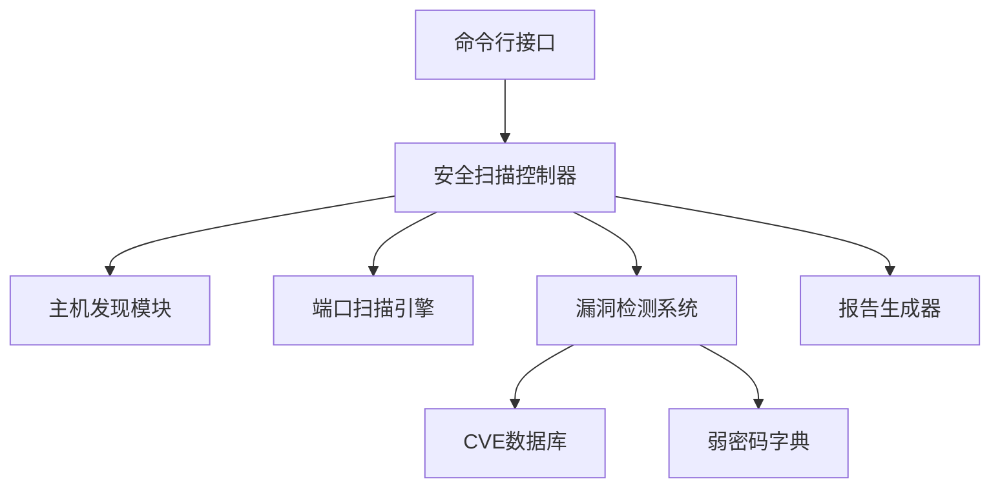

# 网络漏洞扫描器技术文档

## 系统架构
```



## 模块说明

### 1. 主机发现模块
- **技术实现**：基于Scapy的ARP/ICMP协议探测
- **支持协议**：
  - ARP扫描（局域网）
  - ICMP Ping（广域网）
  - TCP SYN扫描（需特权）

### 2. 端口扫描引擎
- **扫描模式**：
  - SYN半开扫描（快速）
  - TCP全连接扫描（兼容）
- **优化策略**：
  - 随机化扫描顺序
  - 多线程并发
  - 滑动窗口控制

### 3. 漏洞检测系统
- **检测类型**：
  - CVE已知漏洞（基于版本匹配）
  - 弱密码爆破（SSH/FTP）
  - 不安全配置检测
- **插件架构**：
  ```python
  class BasePlugin:
      def check(self, host, port, banner):
          pass
  ```

## 配置文件说明
| 文件路径 | 作用 |
|---------|------|
| `data/cve_db.json` | 定义CVE漏洞匹配规则 |
| `data/weak_passwords.txt` | 常用弱密码字典 |

## 插件开发指南
1. 继承`BasePlugin`基类
2. 实现`check`方法
3. 将插件文件放入`plugins`目录
```python
from scanner.plugins import BasePlugin

class DemoPlugin(BasePlugin):
    def check(self, host, port, banner):
        if "test" in banner:
            return ["测试漏洞"]
        return []
```

## 性能优化策略
- **网络层**：原始套接字复用
- **计算层**：LRU缓存机制
- **存储层**：结果分块处理

## 法律合规要求
1. 扫描前必须获得书面授权
2. 禁止扫描关键基础设施
3. 遵守《网络安全法》相关规定

## 已知问题与TODO
- [ ] Windows平台SYN扫描支持,建议在Linux环境下使用Python 3.8+执行，Windows系统需配置WinPcap驱动支持。
- [ ] 分布式扫描架构
- [ ] 漏洞验证POC集成


